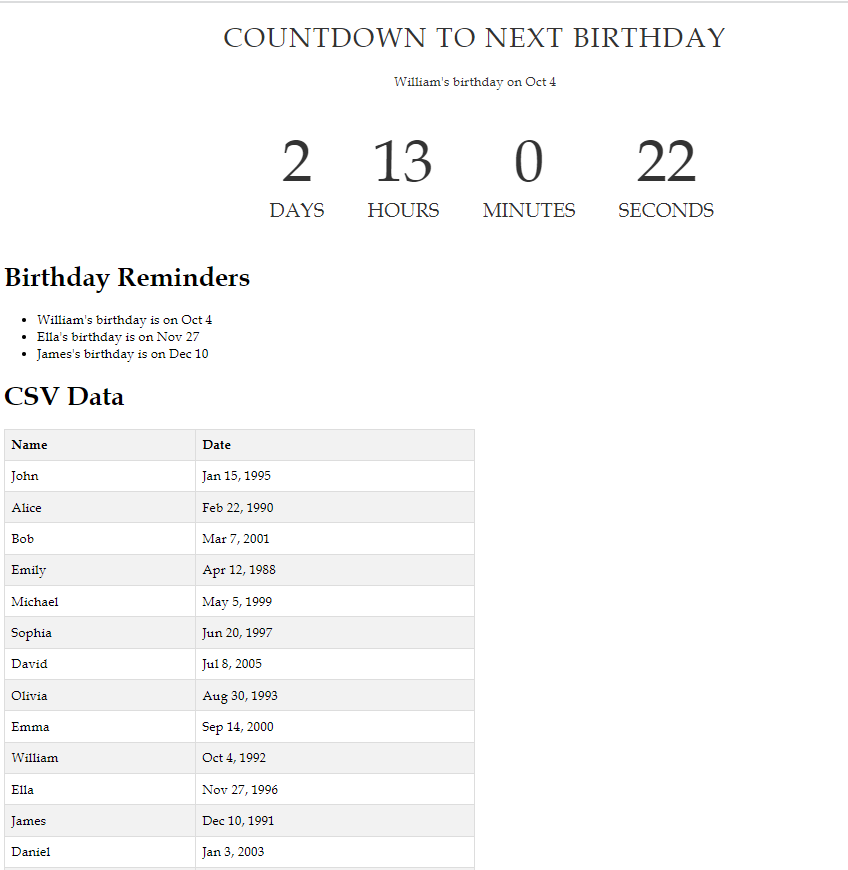

# Birthday Reminder App

The Birthday Reminder App is a simple web application built with Svelte to help you keep track of upcoming birthdays. You can add birthdays, view a list of upcoming ones, and remove them when they've passed. Never forget a birthday again!

## Features

- Add and remove birthdays.
- View a list of upcoming birthdays.
- Simple and intuitive user interface.

## Demo

You can try the app live. [But Not yet it.](#https://example.com).

## Screenshots



## Getting Started

Follow these instructions to get a copy of the project up and running on your local machine.

### Prerequisites

You need to have Node.js and npm (Node Package Manager) installed on your computer. If you don't have them, you can download and install them from [https://nodejs.org/](https://nodejs.org/).

### Installation

1. Clone the repository:

   ```bash
   git clone https://github.com/KSDeshappriya/BirthdayReminder.git
   ```

2. Navigate to the project directory:

   ```bash
   cd birthday-reminder
   ```

3. Install the project dependencies:

   ```bash
   npm install
   ```

### Usage

1. Start the development server:

   ```bash
   npm run dev
   ```

2. Open your browser and go to [http://localhost:5173](http://localhost:5173) to use the application.

### Contributing

Contributions are welcome! If you'd like to contribute to this project, please follow these steps:

1. Fork the project on GitHub.

2. Create a new branch for your feature or bug fix:

   ```bash
   git checkout -b feature/your-feature-name
   ```

3. Make your changes and commit them:

   ```bash
   git commit -m "Add your feature or bug fix"
   ```

4. Push your changes to your fork:

   ```bash
   git push origin feature/your-feature-name
   ```

5. Create a pull request on the original repository, explaining your changes.

### License

This project is licensed under the `CC BY-NC 4.0` License - see the [LICENSE.MD](LICENSE.MD) file for details.

### Acknowledgments

- Thanks to the Svelte community for their awesome framework!